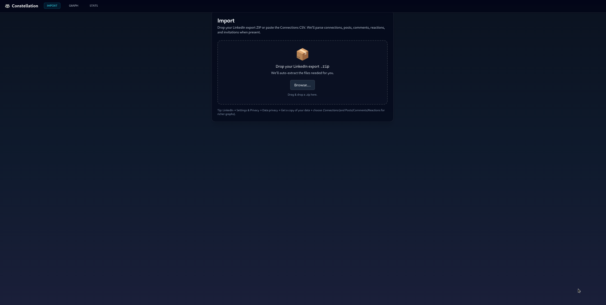
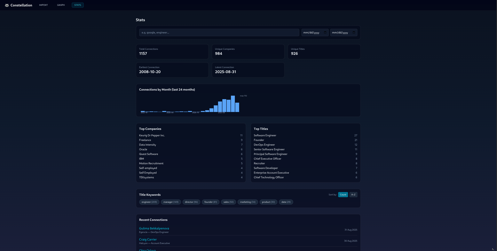
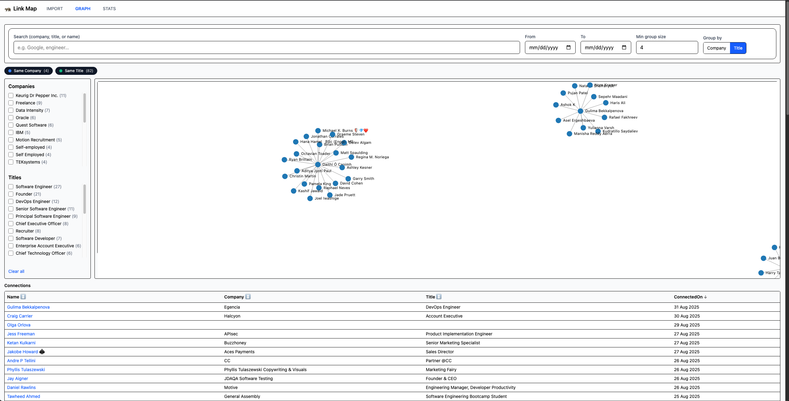

# 🌌 Constellation

_Visualize your LinkedIn network like a constellation — built with React, TypeScript, and TailwindCSS._ 🦝

[](https://github.com/NickTheDevOpsGuy/Constellation/actions/workflows/constellation-ci.yml)


---

## 🚀 What’s New

<!-- START:WHATS_NEW -->
_No code changes found in the recent range._
<!-- END:WHATS_NEW -->

---

## 🚀 Features

- 📥 **Import CSV**  
  Upload your exported LinkedIn connections file directly (drag & drop).  
  The parser cleans up preamble lines and normalizes fields like `First Name`, `Last Name`, `Company`, `Title`, and `Connected On`.

- 📊 **Stats Dashboard**
  - 🔝 Top 5 companies in your network
  - 🏷️ Top 5 titles across your connections
  - 📅 Recent connection list (latest 5)
  - 🔢 Total connection count

- 🛠️ **Toolbar Filters**
  - 🔎 Search by company/title text
  - 📅 Date range filter (from/to connection date)
  - 📉 Minimum group size filter
  - 🔀 Mode toggle: _Company_ vs _Title_ views

- 🗺️ **Graph View**
  - 🟦 One node per person (laid out in a circle for now)
  - 🖱️ Pan & zoom controls
  - 🏷️ Labels and tooltips with company + title info
  - 🚧 Edges + clustering coming soon!

- 🎨 **Clean UI**  
  Built with TailwindCSS, responsive grid layouts, and a lightweight NavBar.

---

## 🔒 Privacy 

This app is designed for **local use only**.

- All processing (CSV import, parsing, graphing, and stats) happens **in your browser**.
- No data is sent to any server, API, or third party.
- Your LinkedIn export files stay entirely on your computer.

This means you can safely explore and visualize your network without worrying about your data being leaked or stored anywhere outside of your machine. 🚀

---

## 🗓️ Roadmap

- 🔗 Add edges (grouping by company/title)
- 🎨 Color & size nodes based on importance (degree, company cluster)
- 🖱️ Hover interactions (show labels only on hover)
- 📤 Export stats/graph snapshots for sharing

---

## 🛠 Tech Stack

- [React](https://react.dev/) + [Vite](https://vite.dev/)
- [TypeScript](https://www.typescriptlang.org/)
- [Tailwind CSS v4](https://tailwindcss.com/)

---

## 📦 Getting Started

Clone the repo and install dependencies:

1. Clone repo: `git clone …`
2. Install deps: `npm install`
3. Start dev: `npm run dev`
4. Then open `http://localhost:5173` in your browser.

---

## 🖼 Preview

### Main App



### Filters Stats



### Graph of Stats



---

## 📂 Project Structure

<details>
<summary>📁 Click to expand project file structure</summary>

```plaintext
.
├── .github
│   ├── ISSUE_TEMPLATE
│   │   ├── bug_report.md
│   │   └── feature_request.md
│   └── workflows
│       ├── codeql.yml
│       ├── commit-update.yml
│       └── constellation-ci.yml
├── .gitignore
├── .prettierignore
├── .prettierrc.json
├── .prettierrc.yml
├── eslint.config.js
├── index.html
├── package-lock.json
├── package.json
├── README.md
├── Screenshots
│   ├── graph.png
│   ├── main.png
│   └── stats.png
├── scripts
│   └── precheck.sh
├── src
│   ├── app
│   │   ├── components
│   │   │   ├── ConnectionsTable.tsx
│   │   │   ├── Facets.tsx
│   │   │   ├── FileDrop.tsx
│   │   │   ├── GraphCanvas.tsx
│   │   │   ├── Layout.tsx
│   │   │   ├── Legend.tsx
│   │   │   ├── NavBar.tsx
│   │   │   ├── StatsPanel.tsx
│   │   │   ├── StatsToolbar.tsx
│   │   │   └── Toolbar.tsx
│   │   ├── hooks
│   │   │   └── useLinkMap.ts
│   │   ├── main.tsx
│   │   ├── pages
│   │   │   ├── GraphPage.tsx
│   │   │   ├── ImportPage.tsx
│   │   │   └── StatsPage.tsx
│   │   ├── styles
│   │   │   └── global.css
│   │   ├── types
│   │   │   └── linkedin.ts
│   │   └── utils
│   │       ├── edgeBuilders.ts
│   │       ├── edgeColors.ts
│   │       ├── extractFromZip.ts
│   │       ├── parseComments.ts
│   │       ├── parseCsv.ts
│   │       ├── parseInvitations.ts
│   │       ├── parseReactions.ts
│   │       ├── parseShares.ts
│   │       ├── quickFilterGraph.ts
│   │       ├── rowsToGraph.ts
│   │       ├── summarize.ts
│   │       └── time.ts
│   └── public
│       └── constellation.svg
├── tailwind.config.ts
├── tsconfig.app.json
├── tsconfig.json
└── vite.config.ts
```

</details>

---

## 🧑‍💻 Usage Tips

- Export your LinkedIn data:  
  _Me → Settings & Privacy → Data Privacy → Get a copy of your data → Connections CSV_
- Drag the `ZIP` into the Import screen
- Switch to **Stats** or **Graph** via the nav bar
- Click names in the table or nodes in the graph to jump to their profile 🎯

### 🎨 Edge Colors

- **Gray** – Direct connections or fallback grouping
- **Pink** – Same Company (inferred)
- **Teal** – Same Title (inferred)
- **Blue / Green / Orange / Purple** – Post interactions _(authored, commented, liked, reacted)_

👉 You can toggle each edge type on/off from the in-app legend to explore different views of your network.

---

🏗 **Built For Learning**

This project is a small practice app to learn how to combine:

- ⚛️ React + TypeScript patterns
- 🎨 Tailwind v4 styling
- 🕸️ Graph visualization with react-force-graph
- 🌍 Sharing work in public

---

## 🤝 Contributing

Contributions, feedback, and ideas are very welcome! 🦝✨

Here’s how you can help:

- 🐛 **Report bugs**: Open an [issue](../../../../issues) with steps to reproduce.
- 💡 **Suggest features**: Have an idea? File an [feature](../../../../issues) or start a discussion.
- 🔧 **Open a PR**: Create a branch, and open a pull request.
- 🖼 **Design/UI ideas**: Share mockups or styling suggestions.

### Local Development

1. Fork and clone this repo
2. Install dependencies:
3. `bash npm i`
4. `bash npm run dev`
5. Make your changes, test locally
6. Commit with a clear message and push a branch
7. Open a PR 🚀

---

## 🙋‍♂️ About the Author

Built with 💻 by [Nicholas Clark](https://www.linkedin.com/in/nickdoesdevops)

- Follow the journey: #NickDoesDevOPS

🧠 #NickDoesDevOps • 🚀 #LearningInPublic • 🔧 #WorldDomination

- GitHub: [NickTheDevOpsGuy](https://github.com/NickTheDevOpsGuy)

## 📄 License

MIT
