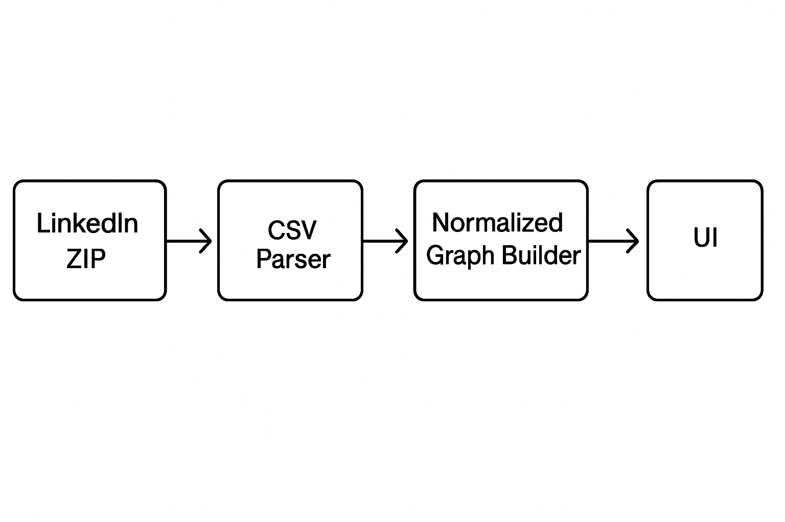

# 🌌 Constellation

_Visualize your LinkedIn network like a constellation — clusters, trends, and hidden relationships at a glance._ 🦝  

[](https://github.com/NickTheDevOpsGuy/Constellation/actions/workflows/constellation-ci.yml)


---

## 🖼 Preview

A quick look at what Constellation renders from your LinkedIn export:

### Main App


### Filter Stats


### Interactive Graph


---

## 🌐 Live Demo

Try Constellation here: **https://constellation-alpha.vercel.app/**  
Zero backend. All processing stays in your browser.

---

## 🔧 How It Works



LinkedIn ZIP → CSV Parser → Normalized Rows → Graph Builder → UI

Use it to understand the shape of your network — who you connect with most, how roles cluster, and where hidden opportunities live.

---

## 🚀 Features

### 📥 Import & Parse
- Drag-and-drop your LinkedIn `.zip`
- Automatic CSV cleanup & normalization  
- Extracts names, titles, companies, dates, interactions (posts, comments, reactions)

### 📊 Stats Dashboard
- Top companies & titles  
- Latest 5 connections  
- Total counts & quick summaries

### 🎛 Filters
- Text search (company/title)
- Date range
- Minimum group size
- Company / Title mode toggle

### 🗺 Graph View
- Zoom, pan, interactive nodes
- Color-coded edges by relationship
- Tooltips with rich metadata
- Clustering coming soon

---

## 🔒 Privacy First! 


Constellation is designed for 100% local use:

- All parsing, graph building, and analytics happen in your browser
- No servers, no uploads, no logs, no tracking
- Ideal for sensitive career or professional datasets

Your LinkedIn data never leaves your machine.

---

## 🗓️ Roadmap

### 🌐 Multi-Dataset Support

- Compare different exports (e.g., before/after job changes).

### 🧠 Advanced Analytics

- Community detection (Louvain/modularity)
- Centrality scoring (PageRank, betweenness, degree)

### 🖼 Visualization Upgrades

- Mini-map
- “Jump to node” search
- Richer tooltips
- Profile photo support
- Dark mode polish

### 🔗 Edge Insights

- Weighted edges (interactions, frequency, recency)
- Curved or directional edges
- Animation for timelines

### 📤 Export / Sharing

- Export filtered CSV
- Share interactive snapshots (self-contained HTML)

---

## 🛠 Tech Stack

- [React](https://react.dev/) + [Vite](https://vite.dev/)
- [TypeScript](https://www.typescriptlang.org/)
- [Tailwind CSS v4](https://tailwindcss.com/)

---

## 📦 Getting Started

Clone the repo and install dependencies:

1. Clone repo: `git clone …`
2. Install deps: `npm install`
3. Start dev: `npm run dev`
4. Then open `http://localhost:5173` in your browser.

---

## 📂 Project Structure

<details>
<summary>📁 Click to expand project file structure</summary>

```plaintext
.
├── eslint.config.js
├── .github
│   ├── ISSUE_TEMPLATE
│   │   ├── bug.yml
│   │   ├── config.yml
│   │   ├── documentation.yml
│   │   ├── enhancement_refactor.yml
│   │   ├── feature_request.yml
│   │   └── question_discussion.yml
│   ├── pull_request_template.md
│   └── workflows
│       ├── codeql.yml
│       └── constellation-ci.yml
├── .gitignore
├── .husky
│   ├── _
│   │   ├── applypatch-msg
│   │   ├── commit-msg
│   │   ├── .gitignore
│   │   ├── h
│   │   ├── husky.sh
│   │   ├── post-applypatch
│   │   ├── post-checkout
│   │   ├── post-commit
│   │   ├── post-merge
│   │   ├── post-rewrite
│   │   ├── pre-applypatch
│   │   ├── pre-auto-gc
│   │   ├── pre-commit
│   │   ├── pre-merge-commit
│   │   ├── prepare-commit-msg
│   │   ├── pre-push
│   │   └── pre-rebase
│   ├── pre-commit
│   └── pre-push
├── index.html
├── package.json
├── package-lock.json
├── .prettierignore
├── .prettierrc.json
├── .prettierrc.yml
├── README.md
├── Screenshots
│   ├── graph.png
│   ├── main.png
│   └── stats.png
├── scripts
│   └── precheck.sh
├── src
│   ├── app
│   │   ├── components
│   │   │   ├── ConnectionsTable.tsx
│   │   │   ├── Facets.tsx
│   │   │   ├── FileDrop.tsx
│   │   │   ├── GraphCanvas.tsx
│   │   │   ├── GraphDimToggle.tsx
│   │   │   ├── Layout.tsx
│   │   │   ├── Legend.tsx
│   │   │   ├── NavBar.tsx
│   │   │   ├── StatsPanel.tsx
│   │   │   ├── StatsToolbar.tsx
│   │   │   ├── Timeline.tsx
│   │   │   └── Toolbar.tsx
│   │   ├── hooks
│   │   │   ├── useCommunities.ts
│   │   │   └── useLinkMap.ts
│   │   ├── main.tsx
│   │   ├── pages
│   │   │   ├── GraphPage.tsx
│   │   │   ├── ImportPage.tsx
│   │   │   └── StatsPage.tsx
│   │   ├── styles
│   │   │   └── global.css
│   │   ├── types
│   │   │   ├── graphology-metrics.d.ts
│   │   │   └── linkedin.ts
│   │   └── utils
│   │       ├── edgeBuilders.ts
│   │       ├── edgeColors.ts
│   │       ├── extractFromZip.ts
│   │       ├── parseComments.ts
│   │       ├── parseCsv.ts
│   │       ├── parseInvitations.ts
│   │       ├── parseReactions.ts
│   │       ├── parseShares.ts
│   │       ├── quickFilterGraph.ts
│   │       ├── rowsToGraph.ts
│   │       ├── summarize.ts
│   │       └── time.ts
│   ├── public
│   │   └── constellation.svg
│   └── types
│       └── third-party.d.ts
├── tailwind.config.ts
├── tsconfig.app.json
├── tsconfig.json
└── vite.config.ts
```

</details>

---

## 🧑‍💻 Usage Tips

- Get your data:
LinkedIn → Settings → Data Privacy → Get a copy → Connections CSV
- Drag the `ZIP` into the Import screen
- Switch to **Stats** or **Graph** via the nav bar
- Click names in the table or nodes in the graph to jump to their profile 🎯

### 🎨 Edge Colors

- **Gray** – Direct connections or fallback grouping
- **Pink** – Same Company (inferred)
- **Teal** – Same Title (inferred)
- **Blue / Green / Orange / Purple** – Post interactions _(authored, commented, liked, reacted)_

👉 You can toggle each edge type on/off from the in-app legend to explore different views of your network.

---

🏗 **Built For Learning**

This project is a small practice app to learn how to combine:

- ⚛️ React + TypeScript patterns
- 🎨 Tailwind v4 styling
- 🕸️ Graph visualization with react-force-graph
- 🌍 Sharing work in public

---

## 🤝 Contributing

Contributions, feedback, and ideas are very welcome! 🦝✨

Here’s how you can help:

- 🐛 **Report bugs**: Open an [issue](../../../../issues) with steps to reproduce.
- 💡 **Suggest features**: Have an idea? File an [feature](../../../../issues) or start a discussion.
- 🔧 **Open a PR**: Create a branch, and open a pull request.
- 🖼 **Design/UI ideas**: Share mockups or styling suggestions.

### Local Development

1. Fork and clone this repo
2. Install dependencies:
3. `bash npm i`
4. `bash npm run dev`
5. Make your changes, test locally
6. Commit with a clear message and push a branch
7. Open a PR 🚀

---

## 🙋‍♂️ About the Author

Built with 💻 by [Nicholas Clark](https://www.linkedin.com/in/nickdoesdevops)

- Follow the journey: #NickDoesDevOPS

🧠 #NickDoesDevOps • 🚀 #LearningInPublic • 🔧 #WorldDomination

- GitHub: [NickTheDevOpsGuy](https://github.com/NickTheDevOpsGuy)

## 📄 License

MIT
